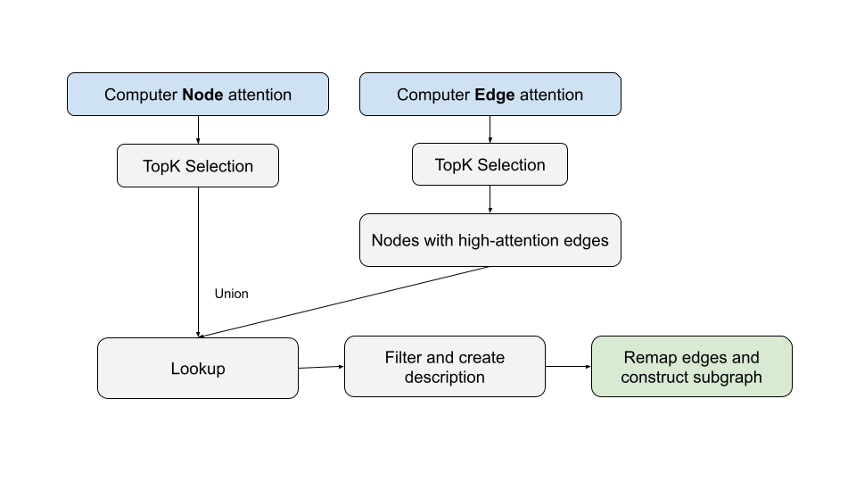

# Efficient-G-Retriever

[](https://arxiv.org/abs/2402.07630)
[](https://arxiv.org/submit/6369079/view)

## Overview

**Efficient-G-Retriever** is an enhanced Retrieval-Augmented Generation (RAG) framework for question answering over textual graphs. This repository builds upon the original [G-Retriever](https://arxiv.org/abs/2402.07630) ([He et al., 2024](#citation)), which introduced PCST-based sub-graph retrieval for RAG. My modifications address the limitations of the original method by introducing a more context-aware and efficient retrieval and encoding pipeline.

## Key Modifications

- **Attention-Based Sub-Graph Retrieval:**
  Replaces PCST with a query-aware, cosine similarity-based attention mechanism for efficient and context-rich sub-graph construction.
- **Joint Node-Edge Encoding:**
  Simultaneously encodes node and edge attributes for richer graph representations.
- **Multi-Head Attention Pooling:**
  Aggregates features using multi-head attention pooling, improving over mean pooling.
- **Enhanced Projection Layer:**
  Utilizes GELU activation, LayerNorm, and increased parameters for improved LLM alignment.

## Method Overview



## Repository Structure

```plaintext
Efficient-G-Retriever/
│── src/
│   ├── dataset/
│   │   ├── utils/
│   │   │   └── retrieval.py  # 📌 Retrieval via attention (Modified)
│   ├── model/
│   │   ├── gnn.py  # 📌 Graph Encoder (Modified)
│   │   └── graph_llm.py  # 📌 LLM Alignment (Modified)
└── results/  # 📈 WandB experiment logs (CSV)
```

## Environment Setup

```bash
conda create --name g_retriever python=3.9 -y
conda activate g_retriever

# https://pytorch.org/get-started/locally/
conda install pytorch==2.0.1 torchvision==0.15.2 torchaudio==2.0.2 pytorch-cuda=11.8 -c pytorch -c nvidia

python -c "import torch; print(torch.__version__)"
python -c "import torch; print(torch.version.cuda)"
pip install pyg_lib torch_scatter torch_sparse torch_cluster torch_spline_conv -f https://data.pyg.org/whl/torch-2.0.1+cu118.html

pip install peft
pip install pandas
pip install ogb
pip install transformers
pip install wandb
pip install sentencepiece
pip install torch_geometric
pip install datasets
pip install pcst_fast
pip install gensim
pip install scipy==1.12
pip install protobuf
```

## Download the Llama 2 Model
1. Go to Hugging Face: https://huggingface.co/meta-llama/Llama-2-7b-hf (requires Meta access).
2. Sign up for a Hugging Face account.
3. Generate an access token: https://huggingface.co/docs/hub/en/security-tokens.
4. Add your token to the code as follows:
   ```python
   from transformers import AutoModel
   access_token = "hf_..."
   model = AutoModel.from_pretrained("private/model", token=access_token)
   ```

## Data Preprocessing

```bash
# expla_graphs
data
python -m src.dataset.preprocess.expla_graphs
python -m src.dataset.expla_graphs

# scene_graphs
data
python -m src.dataset.preprocess.scene_graphs
python -m src.dataset.scene_graphs

# webqsp
data
python -m src.dataset.preprocess.webqsp
python -m src.dataset.webqsp
```

## Training
Replace the path to the LLM checkpoints in `src/model/__init__.py`, then run:

### 1) Inference-Only LLM
```bash
python inference.py --dataset scene_graphs --model_name inference_llm --llm_model_name 7b_chat
```

### 2) Frozen LLM + Prompt Tuning
```bash
python train.py --dataset scene_graphs_baseline --model_name pt_llm
python train.py --dataset scene_graphs --model_name graph_llm
```

### 3) Tuned LLM
```bash
python train.py --dataset scene_graphs_baseline --model_name llm --llm_frozen False
python train.py --dataset scene_graphs --model_name graph_llm --llm_frozen False
```

## Reproducibility
Use `run.sh` to reproduce the published results.

---

## Citation

If you use this repository, please cite the original G-Retriever paper:

```bibtex
@article{he2024gretriever,
  title={G-Retriever: Retrieval-Augmented Generation for Textual Graph Understanding and Question Answering},
  author={He, Xiaoxin and Tian, Yijun and Sun, Yifei and Chawla, Nitesh V. and Laurent, Thomas and LeCun, Yann and Bresson, Xavier and Hooi, Bryan},
  journal={arXiv preprint arXiv:2402.07630},
  year={2024}
}
```
